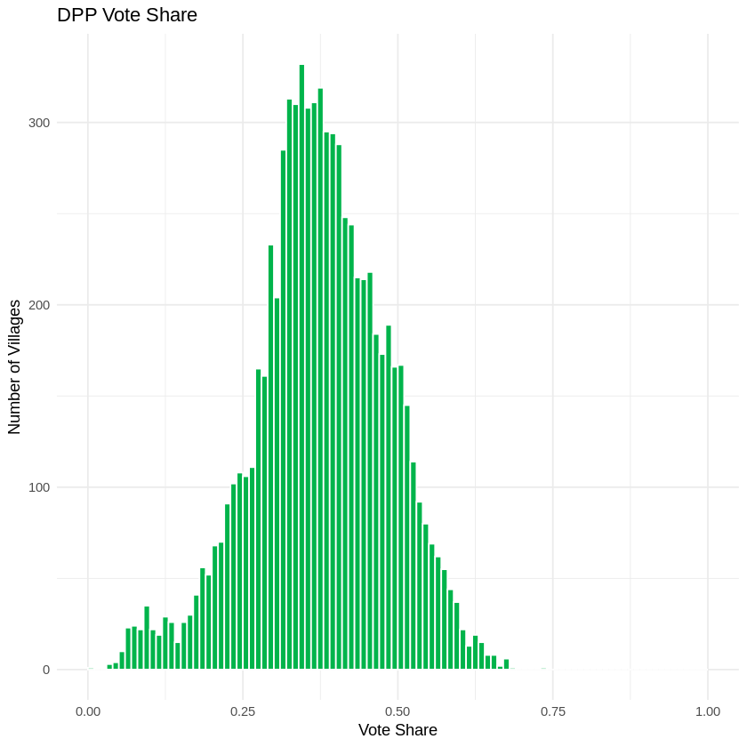
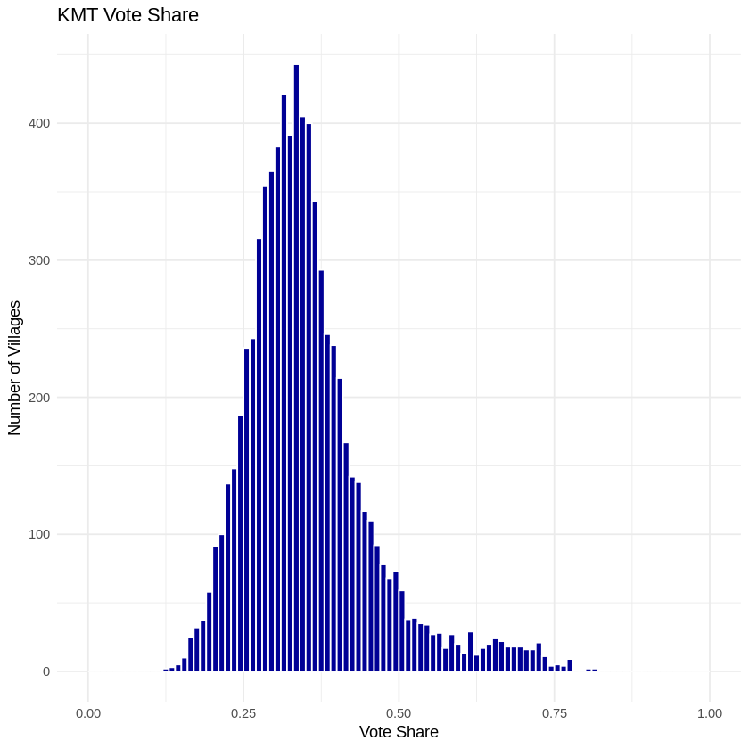
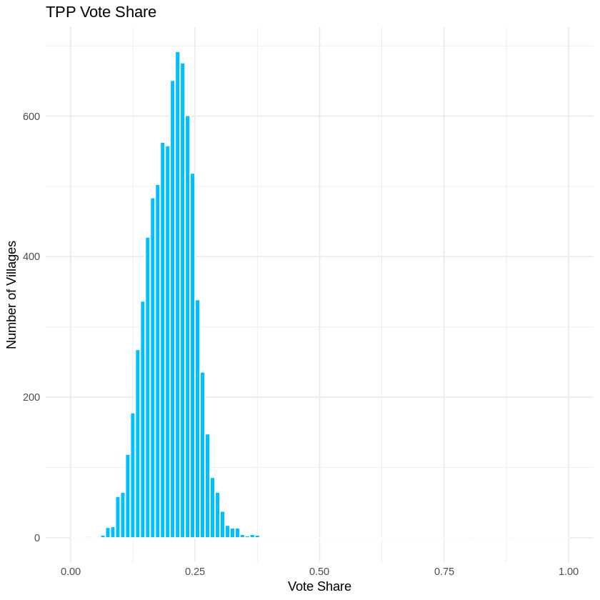
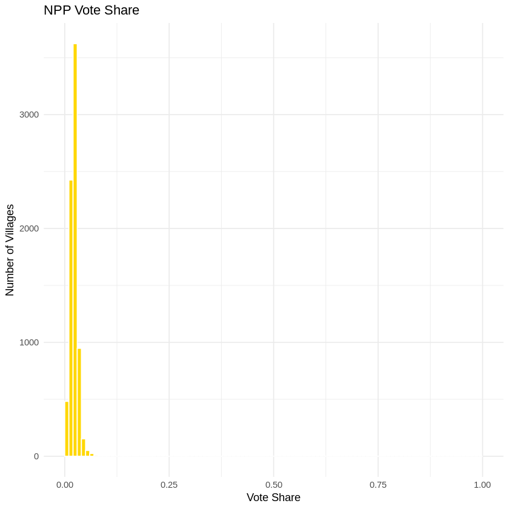

# Analysis Result

## Histograms of the Number of Villages by Party Vote Shares

### DPP

### KMT

### TPP

### NPP

## Linear Regression of Party Vote Share by Village Median Income and Standard Deviation

### Model for DPP:

| term        | estimate    | std_error  | statistic | p_value      |
| ----------- | ----------- | ---------- | --------- | ------------ |
| (Intercept) | 0.47201364  | 0.00523643 | 90.1404   | 0.0000\*\*\* |
| median      | -0.00022266 | 0.00001282 | -17.3677  | 0.0000\*\*\* |
| sd          | 0.00000184  | 0.00000176 | 1.0463    | 0.2954       |

### Model for KMT:

| term        | estimate    | std_error  | statistic | p_value      |
| ----------- | ----------- | ---------- | --------- | ------------ |
| (Intercept) | 0.33952132  | 0.00510551 | 66.5009   | 0.0000\*\*\* |
| median      | 0.00003360  | 0.00001250 | 2.6881    | 0.0072\*\*   |
| sd          | -0.00000106 | 0.00000171 | -0.6204   | 0.5350       |

### Model for TPP:

| term        | estimate    | std_error  | statistic | p_value      |
| ----------- | ----------- | ---------- | --------- | ------------ |
| (Intercept) | 0.12984942  | 0.00211300 | 61.4527   | 0.0000\*\*\* |
| median      | 0.00016323  | 0.00000517 | 31.5530   | 0.0000\*\*\* |
| sd          | -0.00000086 | 0.00000071 | -1.2191   | 0.2228       |

### Model for NPP:

| term        | estimate   | std_error  | statistic | p_value      |
| ----------- | ---------- | ---------- | --------- | ------------ |
| (Intercept) | 0.00551519 | 0.00044081 | 12.5115   | 0.0000\*\*\* |
| median      | 0.00003765 | 0.00000108 | 34.8876   | 0.0000\*\*\* |
| sd          | 0.00000059 | 0.00000015 | 4.0121    | 0.0001\*\*\* |

- \*: p\<0.05
- \*\*: p\<0.01
- \*\*\*: p\<0.001
